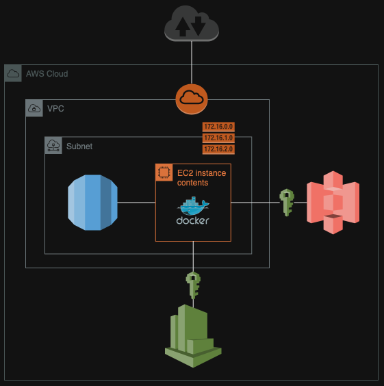

# FastAPI application installer :rocket:

### Cloud infrastructure diagram (x86_64 EC2)

### Introduction :wave:

This repository embodies a unique package that serves several critical objectives with a focus on educational value, ease of deployment, customization, and adherence to best coding and architectural practices as of January 2024. The primary goal is to provide a comprehensive learning experience, guiding users through the rationale behind each implementation, understanding the 'why' and 'how', rather than just the 'what'.

### Educational Value :school:

**Thorough Documentation:** It is committed to meticulously document every aspect of the package. The documentation emphasizes the purpose and reasoning behind each feature and implementation. This approach aims to enhance the learning experience for users, providing them with a deeper understanding of the underlying concepts and choices made during development.

### Streamlined AWS Integration :cloud:

**One-Line Deployment:** The package is designed for seamless integration with AWS services, enabling users to launch a basic application with just a single line of command in the terminal, assuming pre-configured AWS host connection settings. This feature significantly simplifies the process of deploying and managing applications on the cloud.

### Customization and Flexibility :wrench:

**Rapid Adaptation:** Acknowledging the diverse needs of different projects, the package is engineered to allow quick and straightforward adjustments. Users can easily tailor the package to meet specific requirements within a basic scope, providing both flexibility and efficiency in development.

### Technology and Best Practices :star:

**Current Package Versions:** Reflecting the latest advancements as of January 2024, ensuring that all package versions used are up-to-date, offering users the benefits of the latest features, security patches, and optimizations.

**Best Coding and Architectural Practices:** The package is built with a strong emphasis on best practices in coding and architecture. This includes the use of Alpine-based images, known for their lightweight and security-focused design. These practices not only enhance the performance and security of applications but also provide a reference point for users to learn and incorporate these practices into their own development workflows.

### Prerequisites for Working with the Package :school:

Before diving into the package, it's important to familiarize yourself with a few foundational tools and concepts:

- **FastAPI Documentation**: A thorough understanding of FastAPI, a modern, fast web framework for building APIs with Python, is crucial. Familiarize yourself with its key features and functionalities by reviewing [FastAPI Documentation](https://fastapi.tiangolo.com/).
- **Basic Docker Commands**: Knowledge of Docker, a tool designed to make it easier to create, deploy, and run applications using containers, is essential. Brush up on the [Docker Documentation](https://docs.docker.com/get-started/overview/).
- **Basic Terraform Commands**: Terraform, used for building, changing, and versioning infrastructure safely and efficiently, is another key tool. Review the [Terraform Documentation](https://www.terraform.io/docs/index.html) to understand its core principles and commands.

### Why FastAPI, not Flask :muscle:
FastAPI is a modern, fast (high-performance) web framework for building APIs with Python 3.7+ based on standard Python type hints. The key features are:

- **Fast**: Very high performance, on par with NodeJS and Go (thanks to Starlette and Pydantic). One of the fastest Python frameworks available.
- **Fast to code**: Increase the speed to develop features by about 200% to 300%. 
- **Fewer bugs**: Reduce about 40% of human (developer) induced errors.
- **Intuitive**: Great editor support. Completion everywhere. Less time debugging.
- **Easy**: Designed to be easy to use and learn. Less time reading docs.
- **Short**: Minimize code duplication. Multiple features from each parameter declaration. Fewer bugs.
- **Robust**: Get production-ready code. With automatic interactive documentation.

### Advantages of Using Alpine Images for Ubuntu and Postgres :mount_fuji:
The use of Alpine Linux images for our Ubuntu and Postgres containers provides substantial benefits, particularly in terms of efficiency and security. Alpine Linux is renowned for its minimalistic size, which results in significantly lighter and faster containers. This not only reduces the time taken for image downloads and deployments but also lessens the resource consumption, making it ideal for environments with limited resources. Furthermore, Alpine's minimalistic nature means fewer components are susceptible to vulnerabilities, enhancing the overall security of the containers. This makes Alpine an excellent choice for streamlined, secure, and efficient containerized applications.

### Conclusion :bulb:

This package is more than just a tool for development; it's a learning journey for modern software practices, cloud integration, and effective application deployment. Whether you are a beginner looking to understand the intricacies of AWS services and application deployment, or an experienced developer seeking a quick and reliable solution for your AWS-based projects, this package is crafted to meet your needs. Join in exploring the potential of cloud computing with a solid foundation in best practices and cutting-edge technology.

I welcome contributions, feedback, and inquiries to continually improve and update this repository. Let's build and learn together!

### Running the package

To run the package, you have two options depending on your preference:

1. **AWS Deployment:** 
   - First, log in to your AWS account using the AWS Command Line Interface (CLI).
   - Install Terraform on your machine.
   - Navigate to the directory containing the `main.tf` Terraform configuration file.
   - Execute `terraform plan` to review the planned infrastructure changes.
   - Apply these changes by running `terraform apply`.
   - After you're done, and if you wish to tear down the infrastructure, use `terraform destroy`.

2. **Local Deployment:**
   - Ensure you have Docker and Docker Compose installed on your local machine.
   - Run `docker compose up` from the directory containing your `docker-compose.yml` file. 
   - This will start the application locally using Docker.

---

### Helpful Commands

**How to Run Tests** :white_check_mark:

- `cd src`: Change directory to the source code.

- `poetry run python -m pytest .`: Runs tests using pytest within the poetry environment.

**How to Build Image, Run Container, and Remove All After the Job** :whale:

- `docker-compose up`: Starts containers as defined in `docker-compose.yml`. Useful for running the application in a local development environment.

- `docker-compose up --build`: Rebuilds the image and starts the containers. Use this when you've made changes to the Dockerfile or other components of the image.

- `docker build -t [NAME:TAG] . --no-cache`: Builds the Docker image with the tag, ignoring any cached layers. This ensures a fresh build.

- `docker run -p 80:8000 [ID OR NAME]`: Runs the container, mapping port 80 of the host to port 8000 of the container.

- `docker ps`: Lists running containers.

- `docker logs [ID OR NAME]`: Fetches logs of a specific container. Useful for debugging.

- `docker run -it --entrypoint /bin/sh [ID OR NAME]`: Runs the container in interactive mode with a shell entrypoint. Good for exploring inside the container.

- `docker stop [ID OR NAME]`: Stops a running container.

- `docker rm [ID OR NAME]`: Removes a stopped container.

- `docker images`: Lists all Docker images.

- `docker rmi [ID OR NAME]`: Removes the specified image.

- `docker rmi -f $(docker images -q)`: Force removes all images.

- `sudo docker stop $(sudo docker ps -aq)`: Stops all running containers.

- `sudo docker rm $(sudo docker ps -aq)`: Removes all containers.

- `sudo docker system prune -a`: Removes all stopped containers, networks, images (both dangling and unreferenced), and optionally, volumes.

**Potential local Postgres client issues:** :elephant:

- `netstat -an | grep 5432`: Checks if the PostgreSQL port is already in use.

- `brew services stop postgresql`: Stops the PostgreSQL service if it's running locally, freeing up the port.

- Or stop the process via Activity Monitor.

**After Executing the Terraform Script** :mag:

- `sudo aws s3 ls s3://ozieblomichal-fastapi-template-bucket`: Lists objects in the specified S3 bucket.

- `sudo docker logs container_name`: Fetches logs from a specific container.

- `sudo docker exec -it container_name bin/sh`: Executes an interactive shell inside the container.

- `LATEST_LOG=$(sudo aws s3 ls s3://ozieblomichal-fastapi-template-bucket/logs/ --recursive | sort | tail -n 1 | awk '{print substr($0, index($0, $4))}')`: Fetches the latest log file name from the S3 bucket.

- `echo $LATEST_LOG`: Displays the latest log file name.

- `sudo aws s3 cp "s3://ozieblomichal-fastapi-template-bucket/${LATEST_LOG}" - | cat`: Copies the latest log file from S3 and displays its content.

- `/var/log/syslog`, `/var/log/awslogs.log`: View system logs and AWS logs, respectively.

- `sudo find / -type f -name "awslogs-agent-setup.py"`: Finds the location of the AWS logs agent setup script.

- `sudo systemctl status awslogsd`: Checks the status of the AWS logs daemon.

- `crontab -l`: Lists all cron jobs.

- `cat /var/log/cloud-init-output.log`: Views the output log of cloud initialization.

- `grep "crontab" /var/log/cloud-init-output.log`, `grep "log_group_name" /var/log/awslogs.log`: Searches for specific terms in logs for troubleshooting.
