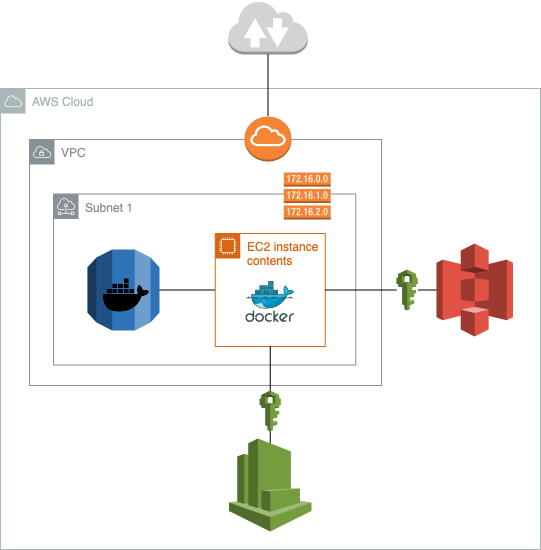

# FastAPI engine :rocket:

### Introduction :wave:

This repository is primarily a **ready-to-use engine (template) for the backend of web applications, designed for the effortless deployment**. It is crafted to facilitate rapid and easy customization, catering to diverse needs and preferences. It represents a distinctive package aimed at achieving several secondary objectives, with an emphasis on educational value. **Documentation focuses on understanding the 'why' and 'how' of the processes, not just the 'what', making it easier to understand the logic behind.** The package ensures adherence to the best coding and architectural practices as of January 2024.

### Streamlined AWS Integration :cloud:

**One-Line Deployment:** The package is designed for seamless integration with AWS services, enabling users to launch a basic application with just a single line of command in the terminal, assuming pre-configured AWS host connection settings. This feature significantly simplifies the process of deploying and managing applications on the cloud.

### Educational Value :school:

**Thorough Documentation:** It is committed to meticulously document every aspect of the package. The documentation emphasizes the purpose and reasoning behind each feature and implementation. This approach aims to enhance the learning experience for users, providing them with a deeper understanding of the underlying concepts and choices made during development.

### Customization and Flexibility :wrench:

**Quick Adaptation:** Acknowledging the diverse needs of different projects, the package is engineered to allow quick and straightforward adjustments. Users can easily tailor the package to meet specific requirements within a basic scope, providing both flexibility and efficiency in development.

### Technology and Best Practices :star:

**Current Package Versions:** Reflecting the latest advancements as of January 2024, ensuring that all package versions used are up-to-date, offering users the benefits of the latest features, security patches, and optimizations.

**Best Coding and Architectural Practices:** The package is built with a strong emphasis on best practices in coding and architecture. This includes the use of Alpine-based images, known for their lightweight and security-focused design. These practices not only enhance the performance and security of applications but also provide a reference point for users to learn and incorporate these practices into their own development workflows.

### Prerequisites for Working with the Package :school:

Before diving into the package, it's important to familiarize yourself with a few foundational tools and concepts:

- **FastAPI Documentation**: A thorough understanding of FastAPI, a modern, fast web framework for building APIs with Python, is crucial. Familiarize yourself with its key features and functionalities by reviewing [FastAPI Documentation](https://fastapi.tiangolo.com/).
- **Basic Docker Commands**: Knowledge of Docker, a tool designed to make it easier to create, deploy, and run applications using containers, is essential. Brush up on the [Docker Documentation](https://docs.docker.com/get-started/overview/).
- **Basic Terraform Commands**: Terraform, used for building, changing, and versioning infrastructure safely and efficiently, is another key tool. Review the [Terraform Documentation](https://www.terraform.io/docs/index.html) to understand its core principles and commands.

### Why FastAPI, not Flask :muscle:
FastAPI is a modern, fast (high-performance) web framework for building APIs with Python 3.7+ based on standard Python type hints. The key features are:

- **Fast**: Very high performance, on par with NodeJS and Go (thanks to Starlette and Pydantic). One of the fastest Python frameworks available.
- **Fast to code**: Increase the speed to develop features by about 200% to 300%. 
- **Fewer bugs**: Reduce about 40% of human (developer) induced errors.
- **Intuitive**: Great editor support. Completion everywhere. Less time debugging.
- **Easy**: Designed to be easy to use and learn. Less time reading docs.
- **Short**: Minimize code duplication. Multiple features from each parameter declaration. Fewer bugs.
- **Robust**: Get production-ready code. With automatic interactive documentation.

### Advantages of Using Alpine Images for Ubuntu and Postgres :mount_fuji:
The use of Alpine Linux images for our Ubuntu and Postgres containers provides substantial benefits, particularly in terms of efficiency and security. Alpine Linux is renowned for its minimalistic size, which results in significantly lighter and faster containers. This not only reduces the time taken for image downloads and deployments but also lessens the resource consumption, making it ideal for environments with limited resources. Furthermore, Alpine's minimalistic nature means fewer components are susceptible to vulnerabilities, enhancing the overall security of the containers. This makes Alpine an excellent choice for streamlined, secure, and efficient containerized applications.

### AWS RDS Postgres vs. Containerized Postgres :grey_question:

**AWS RDS Postgres**
- Advantages: Managed service (simplifies administration), high availability, scalable, secure, integrated monitoring.
- Disadvantages: May lack the latest Postgres version, higher cost, less control, potential vendor lock-in.

**Containerized Postgres**
- Advantages: Access to the latest Postgres versions, more control over configuration, cost-effective, portable across environments.
- Disadvantages: Increased management overhead, complex high availability setup, additional security responsibilities, resource-intensive management.

The choice between AWS RDS and a containerized Postgres hinges on needs for the latest Postgres features, budget, control level, and scalability.

### Running the package :runner:

To run the package, you have two options depending on your preference:

### Cloud infrastructure diagram - variant with RDS (x86_64 EC2)

### Cloud infrastructure diagram - variant with Postgres as a microservice (x86_64 EC2)

1. **AWS Deployment:** 
   - First, log in to your AWS account using the AWS Command Line Interface (CLI).
   - Install Terraform on your machine.
   - Navigate to the `terraform` directory containing the `main.tf` Terraform configuration file. Choose a version using a Postgres database on AWS RDS or available as a microservice in EC2 with the application.
   - Execute `terraform plan` to review the planned infrastructure changes.
   - Apply these changes by running `terraform apply`.
   - After you're done, and if you wish to tear down the infrastructure, use `terraform destroy`.

2. **Local Deployment:**
   - Ensure you have Docker and Docker Compose installed on your local machine.
   - Run `docker compose up` from the main directory containing your `docker-compose.yml` file. 
   - This will start the application locally using Docker.

### How to Run Tests :white_check_mark:

- `cd src`: Change directory to the source code.

- `poetry run python -m pytest .` : Runs tests using pytest within the poetry environment.

### Conclusion :bulb:

This package is more than just an engine; it's a learning journey for modern software practices, cloud integration, and effective application deployment. Whether you are a beginner looking to understand the intricacies of AWS services and application deployment, or an experienced developer seeking a quick and reliable solution for your AWS-based projects, this package is crafted to meet your needs. Join in exploring the potential of cloud computing with a solid foundation in best practices and cutting-edge technology.

I welcome contributions, feedback, and inquiries to continually improve and update this repository. Let's build and learn together!